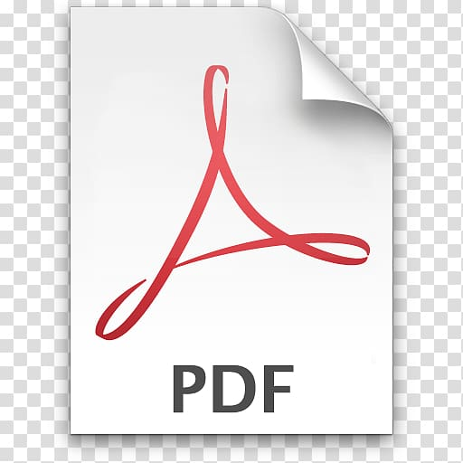

<center>

</center>

## MSc program​: Data and Web Science, 2020 - 2021  
## Course: ​Text Mining and Natural Language Processing

**Team Members​**:
1. George Georgiou   
2. Panagiotis Papaemmanouil   
3. Theodoros Konstantinidis   


<br>

**Project Proposal**: <a href="./docs/Project-Proposal.pdf" class="image fit"></a>

<br>

**Project Report**: <a href="https://drive.google.com/file/d/1oQyURCcDll24ATgKNKdlzE3IytNXIQYR/view?usp=sharing" class="image fit"></a>

<br>

---

# Quora Insincere Questions Classification
### Detect toxic content to improve online conversations


An existential problem for any major website today is how to handle toxic and divisive content. Quora wants to tackle this problem head-on to keep their platform a place where users can feel safe sharing their knowledge with the world.

In this competition, Kagglers will develop models that identify and flag insincere questions. To date, Quora has employed both machine learning and manual review to address this problem. With your help, they can develop more scalable methods to detect toxic and misleading content.

Here's your chance to combat online trolls at scale. Help Quora uphold their policy of “Be Nice, Be Respectful” and continue to be a place for sharing and growing the world’s knowledge.

    

**Kaggle Competition Link**: https://www.kaggle.com/c/quora-insincere-questions-classification


---

# Project setup

<br>

### Virtual Environment

```
$ python3.7 -m venv venv_name
$ source venv_name/bin/activate
$ pip install -r requirements.txt
```
Note: If you use conda, some requirements (i.e wordcloud, textblob) are available via channel conda-forge. 

To add
```
conda config --add channels conda-forge
```


---

### Directory structure

```
.
├── docs               : pictures and other assets
├── input              : input datasets
├── notebooks          : Our Notebooks for 
├── README             : README file for the project
├── requirements.txt   : requirements.txt with module versions and dependencies
├── src                : python code for experiments
└── working            : Kaggle Notebooks 
```
### Kaggle
How to download the competition's dataset using Kaggle API
1. Register an account with Kaggle
2. Generate a new API key at https://www.kaggle.com/$username/account
3. (Linux) Move the downloaded kaggle.json to /home/$USER/.kaggle
4. (Linux) 
```
chmod 600 /home/$USER/.kaggle/kaggle.json
```
5. Accept the competition rules at https://www.kaggle.com/c/quora-insincere-questions-classification/rules
6.
```
$ cd input/
$ kaggle competitions download -c quora-insincere-questions-classification
```

Data directory: `input`

```
.
└── quora-insincere-questions-classification
    ├── embeddings
    │   ├── glove.840B.300d
    │   │   └── glove.840B.300d.txt
    │   ├── GoogleNews-vectors-negative300
    │   │   └── GoogleNews-vectors-negative300.bin
    │   ├── paragram_300_sl999
    │   │   ├── paragram_300_sl999.txt
    │   │   └── README.txt
    │   └── wiki-news-300d-1M
    │       └── wiki-news-300d-1M.vec
    ├── sample_submission.csv
    ├── test.csv
    └── train.csv

```

